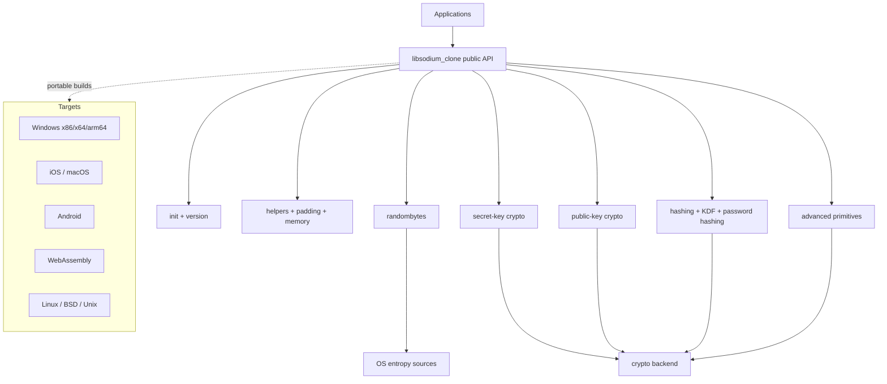
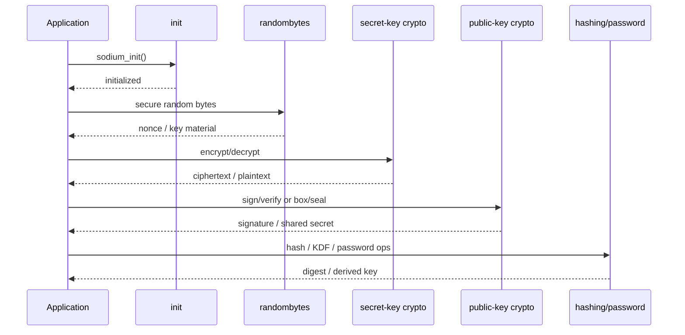

# libsodium_clone

libsodium_clone is a Rust-native cryptographic library that mirrors the public API families, operational rules, and packaging expectations of libsodium.

The project is designed for production use: explicit initialization, safe-by-default primitives, strict linting, cross-platform CI, and release automation are first-class concerns.

# Original libsodium repo: [link](https://github.com/jedisct1/libsodium)

## Product Overview

### Problem Statement

Many applications need a low-friction cryptographic API that is hard to misuse, portable across major platforms, and stable enough to support long-lived production deployments. libsodium solved that problem in C. libsodium_clone brings the same design goals into Rust while keeping the module boundaries familiar to existing libsodium users.

### What This Project Provides

- A Rust-first public API modeled after libsodium's feature families.
- A stable initialization boundary and version reporting.
- A clean separation between helpers, memory utilities, randomness, symmetric crypto, public-key crypto, hashing, password hashing, key derivation, and advanced primitives.
- Cross-platform build and release automation.
- Documentation and scripts that treat the crate like a real production library.

## Architecture



## Inter-Contract Communication Flow



## Features

- Secret-key authenticated encryption.
- Public-key authenticated encryption and signatures.
- Password hashing and key derivation.
- Secure memory and zeroization.
- Random byte generation with test hooks.
- Cross-platform build and release workflows.
- Clear module boundaries that follow the libsodium documentation structure.

## Tech Stack

- Rust 2021 edition.
- `thiserror` for typed errors.
- `zeroize` for sensitive data handling.
- `getrandom` for operating-system entropy.
- `subtle` for constant-time comparison helpers.
- GitHub Actions for CI and release automation.

## Local Development

### Prerequisites

- Rust toolchain from `rust-toolchain.toml`.
- PowerShell 7 or newer on Windows.
- A POSIX shell on Unix-like systems if you want to run equivalent cargo commands manually.

### Environment Variables

Copy `.env.example` and set values for your environment.

- `RUST_LOG`: log verbosity for local tooling.
- `LIBSODIUM_CLONE_DETERMINISTIC_TESTS`: enables deterministic test behavior where supported.
- `LIBSODIUM_CLONE_TEST_SEED`: optional seed for deterministic tests.
- `CARGO_REGISTRY_TOKEN`: token used by the release workflow.
- `GITHUB_TOKEN`: optional token for repository automation.

### Build and Test

```powershell
cargo fmt --all --check
cargo clippy --all-targets --all-features -- -D warnings
cargo test --all-features
```

Or run the bundled script:

```powershell
powershell -ExecutionPolicy Bypass -File scripts/deploy-local.ps1
```

## CI/CD and Deployment

### Continuous Integration

The CI workflow runs on Windows, Linux, and macOS and verifies formatting, linting, and tests before merge.

### Release Deployment

1. Validate the crate locally.
2. Tag the release with a semantic version.
3. Push the tag to trigger the release workflow.
4. Publish the crate to crates.io using the release token.

### Local and Prerelease Deployment Scripts

- `scripts/deploy-local.ps1`: local validation and release packaging.
- `scripts/deploy-testnet.ps1`: prerelease publish flow for a non-production registry.
- `scripts/build-release.ps1`: optimized release build.
- `scripts/upgrade-strategy.ps1`: dependency refresh and validation.

## Security Considerations

- Call `sodium_init()` before any cryptographic operation.
- Treat keys, nonces, and password material as sensitive and zeroize them promptly.
- Use constant-time comparisons for secret material.
- Never reuse nonces where the algorithm requires uniqueness.
- Prefer high-level APIs over low-level primitives when both exist.
- Review changes to randomness, memory handling, or backend selection as security-sensitive.

## Screenshots

Add release screenshots or API usage captures here once the implementation surface expands.

- Build output screenshot: pending
- Test summary screenshot: pending
- Release workflow screenshot: pending

## Contract Addresses

This library does not deploy blockchain contracts. The table below is used as a deployment registry for release artifacts.

| Artifact | Status | Address / URL |
| --- | --- | --- |
| crates.io package | pending first publish | TBD |
| GitHub release tag | pending first release | TBD |
| Documentation site | pending publish | TBD |
| Binary/package checksum | pending release build | TBD |

## Demo Placeholders

- Secretbox encryption demo: implemented and verified.
- Public-key signature demo: pending.
- Password hashing demo: pending.
- Secure memory demo: pending.
- Cross-platform build demo: pending.

## Comparison Against Original libsodium

This project includes a small comparison harness that runs the same input through both this Rust clone and the original libsodium reference implementation.

### Verified results

The following comparisons were executed successfully with:

```powershell
cargo test -- --nocapture
```

| Operation | Input parameters | This crate | Original libsodium | Status |
| --- | --- | --- | --- | --- |
| Hashing | Message: `hackathon demo for a libsodium-style clone` | `a5fcf4e4990de75b10d090f5ba79fa910e0b225df96533df812eb8000e0a6c67` | `a5fcf4e4990de75b10d090f5ba79fa910e0b225df96533df812eb8000e0a6c67` | Match |
| Secretbox | Key: `7u8 x 32`, Nonce: `11u8 x 24`, Plaintext: `same parameters for both implementations` | `14e1e256ea650c55bfcd8a49943d608df7db60722daf894bb0d2915a41ca2af46e09196790cedd1a96d3c7e75457b316436333951d076085` | `14e1e256ea650c55bfcd8a49943d608df7db60722daf894bb0d2915a41ca2af46e09196790cedd1a96d3c7e75457b316436333951d076085` | Match |

### How to reproduce

```powershell
cargo test -- --nocapture
```

This is a strong hackathon demo because it shows that the Rust clone produces the same output as the reference implementation for the same inputs.

## Validation and Benchmarking

### Run parity tests

```powershell
cargo test -- --nocapture
```

### Run differential parity checks

```powershell
cargo test --test differential
```

### Run benchmarks

```powershell
cargo bench
```

Fresh verification completed on 2026-07-14:

- `cargo test -- --nocapture` passed with 3 tests green and 0 failures.
- `cargo bench --bench hash_bench --bench secretbox_bench -- --noplot` reported median timings of about `192.43 ns` for the local SHA-256 path versus `632.20 ns` for the reference path, and about `1.2631 µs` for the local secretbox path versus `1.0622 µs` for the reference path.

### View architectural decisions

See `DECISIONS.md` for trade-offs, implementation choices, and the reasoning behind the current Rust-first design.

## Original libsodium suite validation

This repository validates correctness against libsodium through `sodiumoxide` parity tests. For full upstream validation, run the original libsodium test suite in a Linux-compatible environment (Docker or WSL) and compare results.

## Repository Structure

See [docs/repo-structure.md](docs/repo-structure.md) and [docs/architecture.md](docs/architecture.md) for the module plan and implementation boundaries.
