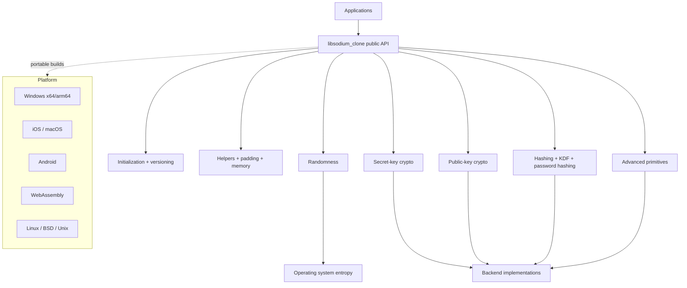

# Architecture

libsodium_clone is organized to mirror the upstream libsodium documentation families while keeping a Rust-first implementation model.

## Goals

- Preserve the user-facing mental model of libsodium: initialize once, then use high-level cryptographic primitives.
- Keep the core API small, auditable, and safe by default.
- Organize modules so each libsodium capability family has a clear Rust owner.
- Support cross-platform builds and packaging from the beginning.

## System Diagram



## Module Boundaries

- `src/init.rs`: one-time library initialization state.
- `src/version.rs`: library naming and version reporting.
- `src/randombytes/`: entropy sources and deterministic test hooks.
- `src/memory/`: secure memory and zeroization primitives.
- `src/helpers/`: encoding, constant-time helpers, and utility functions.
- `src/secret_key/`: secret-key authenticated encryption and stream encryption.
- `src/public_key/`: box, signature, sealed box, KEM, and key exchange APIs.
- `src/hashing/`: generic hashes, XOFs, short-input hashing, and keyed hashes.
- `src/password/`: password hashing and key derivation.
- `src/advanced/`: low-level primitives such as stream ciphers, scalar multiplication, and field arithmetic.

## Repo Layout

```text
PostMortem/
├── Cargo.toml
├── rust-toolchain.toml
├── .gitignore
├── docs/
│   └── architecture.md
└── src/
    ├── lib.rs
    ├── init.rs
    └── version.rs
```

## Implementation Strategy

1. Build a safe Rust core that matches libsodium behavior at the API boundary.
2. Add modules in the same order as the official docs so parity is easy to audit.
3. Lock down CI, formatting, linting, and test coverage before expanding the feature surface.
4. Add deployment and packaging scripts once the library core is stable.
